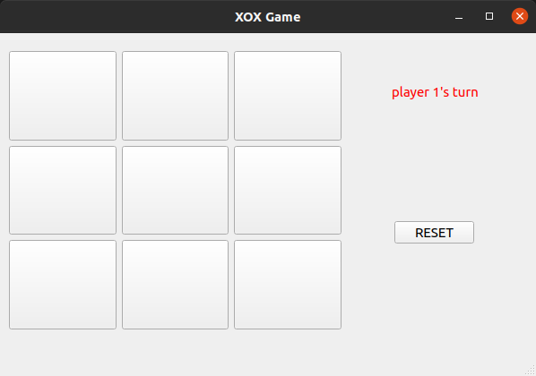
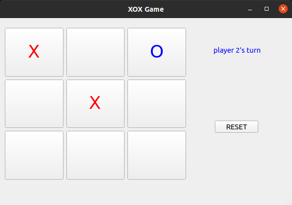
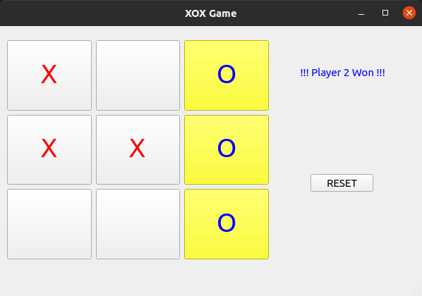

# PyQt XOX Game
It is a game written to practice with PyQt. Simple XOX game played with two players. There is no single player mode.

# Installation

No installation required to play. Executable is in bin directory.

## For Windows
Click **bin/windows/XOXGAME** and play

## For Linux
Grant execute permission for **bin/linux/XOXGAME** then you can click and play.

If you want to add the game to the application menu, run `sudo setup.sh` in terminal. Press `super` key, type "XOXGAME" on search bar.

## Run on source

You must have **python3** and **pyqt5** installed on your system.

Run `python3 XOXGAME.py` on terminal.

# Contact
Salih Bektaş

[salihbektastr@gmail.com](salihbektastr@gmail.com)

[https://github.com/salihbektas](https://github.com/salihbektas)